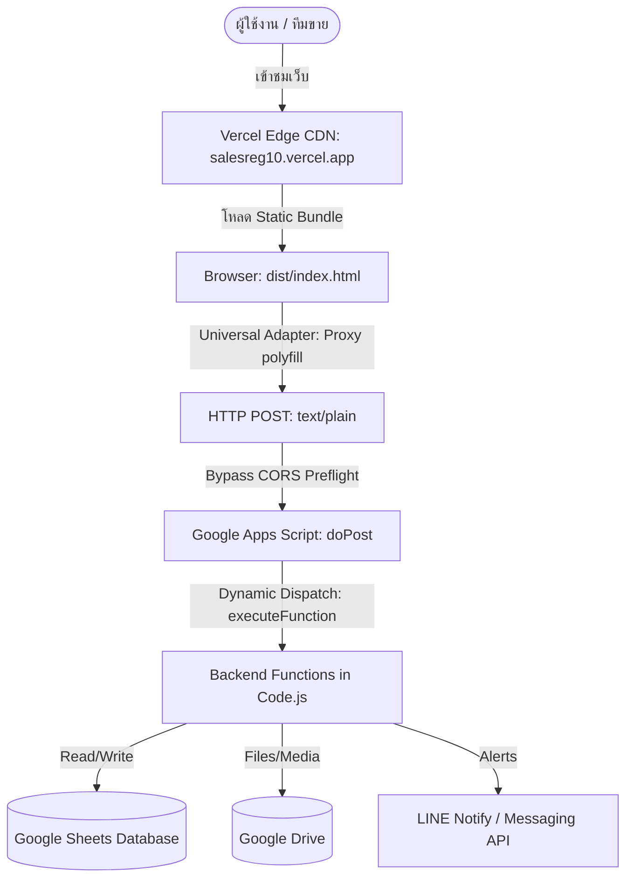
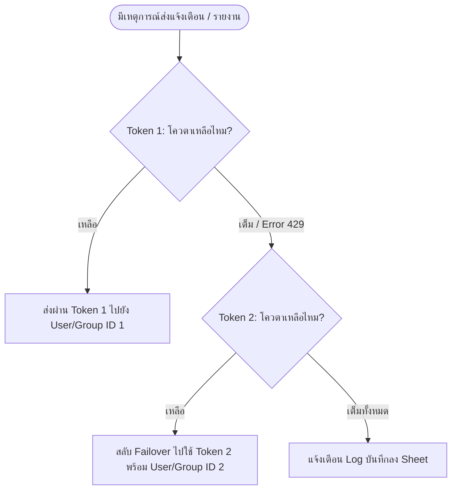

# Project Context: THP Sales Team Reg.10
# สถาปัตยกรรม เทคนิค และคู่มือมาตรฐานการพัฒนา (Architecture, Skills & Guidelines)

เอกสารรวบรวมข้อมูลสถาปัตยกรรม สไตล์การพัฒนา กฎระเบียบ เทคนิคเฉพาะตัว และคู่มือการ Deploy สำหรับระบบ **THP Sales Team Reg.10 (CRM)** เพื่อเป็น **Single Source of Truth** สำหรับทั้งทีมนักพัฒนาและ AI Agent

---

## 1. ภาพรวมระบบและสถาปัตยกรรม (System Overview & Architecture)

- **ประเภทระบบ**: CRM (Customer Relationship Management) สำหรับบริหารจัดการทีมขาย ข้อมูลการเข้าพบลูกค้า ยอดรายได้สะสม และระบบสั่งซื้อสินค้า (BigLot)
- **รูปแบบสถาปัตยกรรม (Decoupled Dual-Platform)**:
  1. **Frontend**: โฮสต์บน **Vercel Edge Network** (URL หลัก: `https://salesreg10.vercel.app`) ให้ความเร็วสูงสุดในการโหลดหน้าเว็บ (CDN Edge Caching) และ URL ที่เป็นมิตร
  2. **Backend API Gateway**: ทำงานบน **Google Apps Script (GAS)** เชื่อมต่อกับ Google Sheets, Google Drive, LINE Messaging API ในรูปแบบ Headless REST/RPC API
  3. **Fallback / Legacy**: รองรับการเปิดใช้งานโดยตรงผ่าน Google Apps Script Web App URL (`AKfycb...`) ได้อย่างสมบูรณ์แบบโดยไม่ต้องแก้โค้ด



---

## 2. สถาปัตยกรรม Decoupled Frontend & Backend API (Vercel + GAS)

### 2.1 ทำไมต้องแยก Frontend ไป Vercel?
- **ความเร็วและ Latency**: Google Apps Script `HtmlService` ต้องประมวลผล template tag `<?!= include(...) ?>` ทุกครั้งที่มี Request ทำให้เปิดหน้าแรกช้า (TTFB 2-4 วินาที) ในขณะที่ Vercel ทำหน้าที่เป็น Static CDN ส่งหน้าเว็บถึงเครื่องผู้ใช้ภายในไม่กี่สิบมิลลิวินาที
- **พ้นข้อจำกัด iframe ของ Google**: ไม่ต้องทำงานอยู่ใต้ `<iframe>` ที่มีข้อจำกัดด้าน Permissions และความปลอดภัยของ Google
- **โดเมนที่จำง่ายและเป็นมืออาชีพ**: `salesreg10.vercel.app` แทน URL ยาวและเข้าใจยากของ Apps Script

### 2.2 ระบบรวมไฟล์อัตโนมัติ (Automated Bundler: `build-web.js`)
- ไฟล์ `build-web.js` ทำหน้าที่แปลงโค้ดจากโครงสร้าง Apps Script มาเป็น Single Page Application (SPA) พร้อมสำหรับ Vercel:
  1. อ่านไฟล์ `Index.html` เป็นไฟล์หลัก
  2. ค้นหาและ Resolve แท็ก `<?!= include('ModuleName'); ?>` แบบ Recursive เพื่อดึงไฟล์ `.html` ทั้งหมดมารวมไว้ในไฟล์เดียว
  3. กำจัดแท็ก `<html>`, `<head>`, `<body>` ที่ซ้ำซ้อนจากไฟล์ย่อย
  4. ทำการ Inject โค้ด **Universal Adapter (Proxy Polyfill)** เข้าไปใน `<head>` ก่อนสร้างผลลัพธ์
  5. บันทึกผลลัพธ์ลงในโฟลเดอร์ `dist/index.html`
- คำสั่งคอมไพล์: `npm run build` หรือรันผ่าน CI/CD บน Vercel

### 2.3 ตัวแปลงคำสั่งอัจฉริยะ (Universal `google.script.run` Adapter)
- **หลักการทำงาน**: เพื่อให้โค้ด Frontend ทั้งหมด (`Module_Core`, `Module_Revenue`, `Module_BigLot` ฯลฯ) ยังคงเรียกใช้ `google.script.run.withSuccessHandler(...).withFailureHandler(...).functionName(args)` ได้เหมือนเดิม 100% โดยไม่ต้องแก้โค้ดแม้แต่บรรทัดเดียว
- ตัว Bundler จะทำการสร้าง ES6 `Proxy` สำหรับ `window.google.script.run`:
  ```javascript
  // Universal Adapter Mechanism
  if (typeof google === 'undefined' || !google.script || !google.script.run) {
    const GAS_BACKEND_URL = 'https://script.google.com/macros/s/AKfycbyHjKL4Sj873PZDGMoOUQ9e_4HAGWL3MqDBGqyicjqujyz4lLI0QytBvD0-0BzxAj5y/exec';
    
    function createRunner(successHandler, failureHandler) {
      return new Proxy({}, {
        get(target, prop) {
          if (prop === 'withSuccessHandler') return (fn) => createRunner(fn, failureHandler);
          if (prop === 'withFailureHandler') return (fn) => createRunner(successHandler, fn);
          return function(...args) {
            fetch(GAS_BACKEND_URL, {
              method: 'POST',
              mode: 'cors',
              headers: { 'Content-Type': 'text/plain;charset=utf-8' },
              body: JSON.stringify({ action: 'executeFunction', functionName: prop, args: args })
            })
            .then(res => res.json())
            .then(data => {
              if (data && data.__gas_execution__) {
                if (data.success && successHandler) successHandler(data.result);
                else if (!data.success && failureHandler) failureHandler(new Error(data.error));
              } else if (successHandler) {
                successHandler(data);
              }
            })
            .catch(err => { if (failureHandler) failureHandler(err); });
          };
        }
      });
    }
    window.google = window.google || {};
    window.google.script = { run: createRunner() };
  }
  ```

### 2.4 เทคนิคการบายพาส CORS บน Google Apps Script (`text/plain;charset=utf-8`)
> [!IMPORTANT]
> **ข้อจำกัดสำคัญของ Google Apps Script**:
> GAS Web App **ไม่รองรับ** HTTP preflight request (`OPTIONS`) หาก Frontend ยิง `fetch()` ด้วย `Content-Type: application/json` เบราว์เซอร์จะส่ง `OPTIONS` นำหน้าเสมอ และ GAS จะตอบกลับด้วยข้อผิดพลาด CORS ทันที!
- **ทางออกที่ถูกต้อง (The Solution)**:
  - กำหนด Header ของคำขอเป็น `'Content-Type': 'text/plain;charset=utf-8'` พร้อมกับ `'mode': 'cors'`
  - มาตรฐานเบราว์เซอร์จัดว่า `text/plain` เป็น **Simple Request** จึงไม่ส่ง `OPTIONS` preflight request
  - ฝั่งเซิร์ฟเวอร์ GAS (`Code.js`) สามารถอ่าน Payload ได้โดยตรงผ่าน `e.postData.contents` และสั่ง `JSON.parse()` ใช้งานได้ทันที 100%

### 2.5 Headless API Gateway บนฝั่งเซิร์ฟเวอร์ (`Code.js: doPost`)
- ฝั่ง `Code.js` เพิ่มการรองรับ Action พิเศษ `executeFunction`:
  ```javascript
  if (action === 'executeFunction') {
    var functionName = postData.functionName;
    var args = postData.args || [];
    if (typeof this[functionName] === 'function') {
      try {
        var result = this[functionName].apply(null, args);
        return ContentService.createTextOutput(JSON.stringify({
          __gas_execution__: true,
          success: true,
          result: result
        })).setMimeType(ContentService.MimeType.JSON);
      } catch (fnErr) {
        return ContentService.createTextOutput(JSON.stringify({
          __gas_execution__: true,
          success: false,
          error: fnErr.toString()
        })).setMimeType(ContentService.MimeType.JSON);
      }
    }
  }
  ```

---

## 3. สถาปัตยกรรมวงจรข้อมูลและการโหลด (Data Lifecycle & Target Loading)

### 3.1 กฎการโหลดข้อมูลเป้าหมายรายได้ (Revenue Target Loading Rule)
> [!WARNING]
> **กับดักข้อมูลหัวตาราง (Header Row Pitfall)**:
> เมื่อดึงข้อมูลเป้าหมายจาก Google Sheets แถวที่ 0 จะเป็น Header เสมอ (เช่น `['TargetDate', 'Zone', ...]`) ดังนั้นเมื่อไม่มีข้อมูลจริง `targetData.length` จะเท่ากับ **1** (ไม่ใช่ 0!)
- **ข้อกำหนดที่ต้องปฏิบัติตามอย่างเคร่งครัด**:
  1. การตรวจสอบว่าข้อมูลเป้าหมายว่างหรือไม่ **ห้าม** เช็คเพียง `!targets || targets.length === 0` เพราะค่า `length === 1` จะหลุดรอดและถูกเข้าใจผิดว่ามีข้อมูลแล้ว
  2. **ต้องตรวจสอบด้วย**:
     ```javascript
     const missingRevTargets = (!window.globalRevenueTargets || window.globalRevenueTargets.length <= 1);
     const missingBigLotTargets = (!window.globalBigLotTargets || window.globalBigLotTargets.length <= 1);
     ```
  3. **การซิงโครไนซ์ Scope**: ทุกครั้งที่โหลดเป้าหมายสำเร็จ ต้องอัปเดตลงตัวแปรระดับ Global เสมอ:
     ```javascript
     window.globalRevenueTargets = targets;
     window.globalBigLotTargets = targets;
     ```
  4. เมื่อเปิดหน้าหลัก (Home/Dashboard) ต้องสั่งดึงข้อมูลเป้าหมายอัตโนมัติควบคู่ไปกับยอดรายได้สะสมทันที

### 3.2 ระบบ Global Loader และ Swiper.js Recommendation Carousel
- **มาตรฐาน Global Loader (`showGlobalLoader` / `hideGlobalLoader`)**:
  - ใช้ Modal กลาง (`#globalLoader`) แสดงสินค้าแนะนำ BigLot ระหว่างรอคิวการดึงข้อมูล เพื่อลดความเบื่อหน่ายของผู้ใช้
  - ต้องมี `hideGlobalLoader()` อยู่ในทั้ง Success และ Failure handler ของการเรียกข้อมูลทุกครั้ง
- **Swiper.js Lifecycle**:
  - ต้องทำลายอินสแตนซ์เดิมก่อนสร้างใหม่เสมอ (`swiper.destroy(true, true)`) เพื่อป้องกันอาการสไลด์ค้างหรือ Autoplay ดับ
  - กำหนด `loop: recommendedList.length > 1` (ถ้ามีสไลด์เดียวห้ามเปิด Loop)
  - ซ่อนวิดเจ็ตแนะนำสินค้าบนหน้าหลัก (`#biglot-recommended-container.classList.add('!hidden')`) ระหว่างที่ Global Loader แสดง เพื่อไม่ให้เกิดภาพซ้อนทับกัน
- **กฎการครอบคลุมหน้าจอ (Fullscreen Positioning Standard)**:
  - Loader overlay ต้องใช้ `fixed inset-0 z-[9999] bg-black/60 backdrop-blur-sm` เสมอ **ห้ามใช้ `lg:left-[260px]` เด็ดขาด**
  - *เหตุผล*: หากใช้ `lg:left-[260px]` แม้จะดูพอดีกับ Layout ปกติ แต่เมื่อผู้ใช้อยู่ใน Fullscreen Modal หรือหน้าต่างสรุปผล/ส่งออกรายงาน Loader จะแหว่งทางซ้าย 260px ไม่ครอบคลุมทั้งจอ ทำให้ผู้ใช้สามารถคลิกปุ่มด้านหลังซ้ำซ้อนจนเกิด Race Conditions ได้

### 3.3 ระบบแคชขนาดใหญ่ระดับ Enterprise (IndexedDB + Memory L1/L2/L3 Hybrid SWR Architecture)
- **ปัญหาขีดจำกัด LocalStorage 5MB (The 5MB Bottleneck)**:
  - ในระบบ CRM ตารางประวัติการเข้าพบลูกค้า (`getDataForTable`) มีขนาดใหญ่ถึง **19,754 แถว (ขนาดข้อมูลดิบ 4.58 MB)**
  - เมื่อรวมกับแคชตัวอื่น (`thp_cache_rev_data`, `thp_cache_visit_targets`, `thp_biglot_products`) ขนาดข้อมูลรวมจะเกิน 5MB เบราว์เซอร์จะโยนข้อผิดพลาด:
    `DOMException: Failed to execute 'setItem' on 'Storage': Setting the value of 'thp_cache_visit_raw' exceeded the quota.`
  - ส่งผลให้ระบบไม่สามารถบันทึกแคชได้ และผู้ใช้ต้องรอโหลดสดจาก Google Apps Script ใหม่ทุกครั้ง (5-10 วินาที)
- **สถาปัตยกรรม Hybrid 3 เลเยอร์ (3-Tier Storage Architecture)**:
  - **L1: In-Memory Cache (`_memStore`)**: เก็บ Object ในหน่วยความจำ RAM ของ JavaScript บนเบราว์เซอร์ เพื่อให้ฟังก์ชัน `SafeStorage.getItem(key)` คืนค่าได้แบบ Synchronous ภายใน **0 มิลลิวินาที** ส่งผลให้การทำ SWR Hydration บนหน้าแดชบอร์ดติดขึ้นมาทันทีโดยไม่มีอาการกระตุก
  - **L2: IndexedDB Engine (`thp_sales_db` -> Store: `keyvalue`)**: ใช้ IndexedDB ซึ่งเป็นมาตรฐาน NoSQL บนเบราว์เซอร์ที่รองรับขนาดข้อมูลหลายร้อย MB ไปจนถึงหลาย GB โดยระบบจะ Asynchronously เขียนบันทึกข้อมูลลง IndexedDB ในพื้นหลังโดยไม่บล็อก Main Thread
  - **L3: LocalStorage Fallback**: ใช้จัดเก็บค่า Setting หรือ Config ขนาดเล็ก (< 1MB) หรือในกรณีที่เบราว์เซอร์เปิดโหมด Private Browsing ที่ปิดกั้น IndexedDB
- **ไดอะแกรมวงจร SWR (Stale-While-Revalidate Lifecycle)**:
  ```mermaid
  sequenceDiagram
      autonumber
      actor User as ผู้ใช้งาน
      participant Browser as หน้าเว็บ (SPA)
      participant L1 as L1: Memory Store
      participant L2 as L2: IndexedDB
      participant GAS as Google Apps Script API

      User->>Browser: เปิดหน้าเว็บ / แดชบอร์ด
      Browser->>L1: อ่านข้อมูลจาก Memory Cache (0ms)
      alt มีข้อมูลใน L1/L2
          L1-->>Browser: คืนค่าข้อมูลทันที
          Browser->>User: วาดหน้าจอทันที (0ms Instant Display)
      else แคชว่างเปล่า (First Visit)
          Browser->>User: แสดง Global Loader
      end
      
      Note over Browser,GAS: Background Revalidation (Silent Sync)
      Browser->>GAS: ยิง RPC ดึงข้อมูลสดในเบื้องหลัง
      GAS-->>Browser: ส่งข้อมูลล่าสุดกลับมา (Fresh Data)
      Browser->>L1: บันทึกลง L1 Memory Store
      Browser->>L2: บันทึกลง L2 IndexedDB (Async)
      Browser->>User: อัปเดตข้อมูลบนหน้าจออย่างราบรื่น (Seamless Reactive Re-render)
      Browser->>User: แสดงป้าย "✔ ข้อมูลล่าสุด" (จางหายใน 3.5 วินาที)
  ```
- **รายการคีย์แคชหลักในระบบ**:
  - `thp_cache_visit_raw`: ข้อมูลประวัติการเข้าพบลูกค้า (~19,754 แถว / 4.58MB)
  - `thp_cache_visit_targets`: ข้อมูลเป้าหมายการเข้าพบลูกค้า
  - `thp_cache_rev_targets`: ข้อมูลเป้าหมายรายได้ประจำเดือน
  - `thp_cache_rev_data`: สรุปข้อมูลรายได้ Tableau ประจำวัน
  - `thp_biglot_products`: แคตตาล็อกสินค้า BigLot แนะนำ

### 3.4 นโยบายการจัดการไฟล์ที่อัปโหลด (File Resend Policy)
- หลังจากการอัปโหลดไฟล์ (Tableau, Logistics, DropOff) สำเร็จหรือไม่สำเร็จ **ห้ามเคลียร์ไฟล์ออกจาก input** เพื่อให้ผู้ใช้สามารถกดส่งซ้ำได้ทันทีหากต้องการ
- เคลียร์ไฟล์ทิ้งเมื่อผู้ใช้ **เปลี่ยนหน้า/สลับเมนู** เท่านั้น (ผ่านฟังก์ชัน `switchPage(pageId)`)

---

## 4. มาตรฐานการออกแบบและ UI/UX (Design & Aesthetic Guidelines)

### 4.1 ชุดสีและอัตลักษณ์องค์กร (Color Palette)
- **สีหลัก (Primary Brand)**: สีส้มไปรษณีย์ไทย (`#EA580C`, `#F97316`, `text-theme-orange`, `bg-theme-orange`)
- **สีรองและสถานะ**:
  - แดงเข้ม (`#DC2626`) สำหรับสถานะสำคัญ/ข้อผิดพลาด
  - เขียวมรกต (`#10B981`) สำหรับสถานะสำเร็จ/บริการ
  - ทองอำพัน (`#F59E0B`) สำหรับเป้าหมาย/รางวัล
- **Modal & Overlays**: `fixed inset-0 z-[9999] bg-black/60 backdrop-blur-sm` ป้องกันคลิกทะลุเลเยอร์

### 4.2 กฎปุ่ม Action บน Header (Header Action Buttons Rule)
- ปุ่ม Action เพิ่มเติมที่วางใน Header Action Bar (เช่น ปุ่มรวมรูปภาพ, สรุปการเข้าพบลูกค้า) **ต้องใช้ดีไซน์แบบ Outline เสมอ**:
  ```html
  <button class="bg-white text-orange-600 border border-orange-200 hover:bg-orange-600 hover:text-white transition px-3 py-1.5 rounded-lg text-xs font-semibold shadow-sm">
  ```
- หลีกเลี่ยงการใช้ปุ่มสีทึบ (Solid background) ในพื้นที่นี้ เพื่อรักษาความสบายตาและความกลมกลืนของแถบหัวข้อ

### 4.3 เทคนิคการเร่งความเร็วส่งออกภาพ (High-Speed Image Export Optimization) & ตารางสำหรับ `html2canvas`
- **การจัดกึ่งกลางข้อความตารางสำหรับ `html2canvas`**:
  - เมื่อใช้ `html2canvas` แปลงตาราง HTML เป็นภาพ ข้อความใน `<td>` หรือ `<th>` มักจะตกลงไปชิดขอบล่าง แม้จะใส่ `align-middle` ไว้ก็ตาม
  - **วิธีแก้**: นำ Padding และ vertical-align ออกจาก `<td>`/`<th>` ทั้งหมด แล้วครอบเนื้อหาภายในด้วย `div` ที่มีสไตล์:
    ```html
    <td class="p-0"><div class="flex items-center min-h-[40px] px-2 py-1">เนื้อหา</div></td>
    ```
- **การกำจัด Artificial Delays**:
  - เดิมมีการใส่ `setTimeout` รอ 800ms + 500ms ซ้อนกันในฟังก์ชัน Export ภาพสรุป
  - ปรับปรุงให้ลดเหลือ 80ms และ 50ms หรือใช้ `requestAnimationFrame` เพื่อรอการวาด DOM ให้เสร็จ โดยลดระยะเวลาการรันฝั่ง Client ลงทันทีกว่า 1.2 วินาที
- **Animation & Transition Suppression**:
  - ก่อนที่ `html2canvas` จะเริ่ม Render ให้ปิด CSS transitions และ animations บน Target Container ชั่วคราว เพื่อป้องกันภาพเบลอหรือตัวอักษรซ้อนทับกัน และเปิดคืนค่าหลังจับภาพเสร็จ
- **High-DPI Capture Settings**:
  - ใช้ `scale: 2` เพื่อให้ภาพคมชัดระดับ Retina สำหรับส่งต่อในแอป LINE พร้อมตั้งค่า `useCORS: true`, `allowTaint: true`, `backgroundColor: '#ffffff'`

### 4.4 มาตรฐานการคอนฟิก Chart.js ขั้นสูง
- **Custom HTML Tooltips**: ใช้ `external: function(context)` สร้าง Tooltip แบบลอยด้วย HTML + Tailwind (Glassmorphism `bg-white/95 backdrop-blur-md`) เพื่อความสวยงามพรีเมียม
- **การจัดเรียง 2 คอลัมน์ (Dual-Column Ordering)**: จัดเรียงข้อมูลประวัติศาสตร์ให้ไหลจากบนลงล่างฝั่งซ้าย แล้วต่อด้วยบนลงล่างฝั่งขวา เพื่อให้อ่านง่ายตามไทม์ไลน์
- **Smart X-Axis Multi-line Labels**: หากชื่อลูกค้ายาว ให้เขียนฟังก์ชันแยกคำด้วย Space และคืนค่าเป็น Array `[line1, line2]` เพื่อให้ Chart.js แสดงผล 2 บรรทัดโดยอัตโนมัติ ไม่ถูกตัดคำเป็น `...`
- **ระยะหายใจด้านบน (Y-Axis Grace)**: กำหนด `grace: '25%'` ใน `options.scales.y` เสมอ เพื่อไม่ให้ตัวเลข DataLabels ด้านบนสุดของแท่งกราฟถูกขอบบนของ Canvas บัง
- **แกน X แนวตั้งบนมือถือ (Positive 90-Degree Rotation)**: บนหน้าจอมือถือ (`< 640px`) ให้ตั้งค่า `maxRotation: 90, minRotation: 90` **ห้ามใช้ค่าลบ (-90)** เพราะจะทำให้ Anchor คำนวณเพี้ยนและตัวหนังสือซ้อนทับกราฟ

---

## 5. กฎข้อบังคับเฉพาะสำหรับ Google Apps Script & Enterprise Policies

### 5.1 ข้อจำกัดสิทธิ์ Google Drive ในองค์กร (Enterprise Sharing Restrictions)
- **ข้อห้ามเด็ดขาด**: ห้ามสั่ง `file.setSharing(DriveApp.Access.ANYONE, DriveApp.Permission.VIEW)` ในสคริปต์ เพราะนโยบาย Google Workspace ของ `thailandpost.com` บล็อกการแชร์สาธารณะผ่านสคริปต์
- **วิธีปฏิบัติที่ถูกต้อง**: ให้เซฟไฟล์ลงใน Folder ที่ผู้ดูแลระบบได้ตั้งค่าสิทธิ์แชร์ลิงก์ไว้ล่วงหน้าแล้ว ไฟล์ที่ถูกสร้างใหม่จะสืบทอดสิทธิ์ (Inherit permissions) จากโฟลเดอร์โดยอัตโนมัติ

### 5.2 การป้องกันบั๊ก Timezone ใน Apps Script
- การอ่านวันที่จาก `CalendarApp` หรือ Google Sheets ต้องใช้ `Utilities.formatDate(d, "Asia/Bangkok", "yyyy-MM-dd")` เสมอ
- ห้ามใช้ JavaScript Native Date getter เช่น `d.getDate()` หรือ `d.getMonth()` เด็ดขาด เพราะเซิร์ฟเวอร์ Apps Script มักรันบน UTC/GMT ทำให้วันที่เลื่อนถอยหลังไป 1 วัน

### 5.3 โควตาจำนวน Deployment บน Google Apps Script (20 Versions Max)
- Google Apps Script กำหนดให้ 1 โปรเจกต์มี Versioned Deployments ได้สูงสุด **20 deployments**
- **วิธีอัปเดตเวอร์ชัน Production โดยไม่ให้โควตาเต็ม**:
  - อย่าสร้าง Deployment ใหม่ ให้ทำการ Re-deploy ทับ Deployment ID เดิมที่มีอยู่แล้ว:
    ```powershell
    npx clasp deploy -i AKfycbyHjKL4Sj873PZDGMoOUQ9e_4HAGWL3MqDBGqyicjqujyz4lLI0QytBvD0-0BzxAj5y -V <versionNumber> -d "คำอธิบายเวอร์ชัน"
    ```

### 5.4 การแสดงรูปภาพจาก Google Drive บนหน้าเว็บ
- **ข้อจำกัด**: ลิงก์มาตรฐานของ Google Drive (เช่น `/file/d/.../view?usp=drive_link`) เป็นหน้าเว็บพรีวิว HTML ไม่ใช่ไฟล์ภาพโดยตรง และหากใส่ใน `` จะทำให้ภาพแตกทันที
- **เทคนิคการแปลง URL สากล (`window.transformGoogleDriveUrl`)**:
  - สกัดรหัส `FILE_ID` จากลิงก์ Drive แล้วแปลงไปใช้ Google Usercontent CDN:
    `https://lh3.googleusercontent.com/d/FILE_ID=s600`
  - URL นี้มี Header `Access-Control-Allow-Origin: *` และไม่ต้องใช้ Cookie ยืนยันตัวตน ทำให้เบราว์เซอร์ทุกตัวแสดงผลรูปภาพผ่านแท็ก `` ได้อย่างคมชัดและรวดเร็ว 100%
  - กำหนด `onerror` สำรองไว้เสมอเพื่อสลับไปใช้ `drive.google.com/thumbnail?id=FILE_ID&sz=w600` หาก CDN ติดปัญหา ชั่วคราว

### 5.5 ประสิทธิภาพการทำงานกับ Google Drive บน Backend (Avoid Synchronous File Iteration)
- **ข้อห้ามเด็ดขาด**: ห้ามใช้ `folder.searchFiles(...)` หรือ `folder.getFiles()` วนลูปเพื่อหาและลบไฟล์เก่าใน Interactive Request ที่ผู้ใช้กำลังรอหน้าจอ (เช่น ในฟังก์ชัน `saveCustomerReportImage`)
- **เหตุผล**: โฟลเดอร์ใน Google Drive ที่มีไฟล์สะสมอยู่หลายร้อยหรือหลายพันไฟล์ คำสั่งค้นหาไฟล์ผ่าน Apps Script DriveApp จะใช้เวลานานมหาศาล (10-15 วินาที) ทำให้การส่งออกภาพของผู้ใช้ช้าลงมาก และเสี่ยงต่อการติด Timeout (6 นาที) ของ GAS
- **วิธีปฏิบัติที่ถูกต้อง (Fast Write Path)**:
  - ให้สร้างไฟล์ใหม่และส่ง URL คืนให้ Frontend ทันที
  - ย้ายงานทำความสะอาดไฟล์เก่า (Garbage Collection) ไปรันเป็น Background Time-driven Trigger ประจำวัน/สัปดาห์ หรือแยกโฟลเดอร์จัดเก็บตามเดือน

---

## 6. สถาปัตยกรรมระบบแจ้งเตือน LINE Messaging API & Failover



### 6.1 ปัญหาข้อจำกัดโควตาข้อความ (LINE OA Monthly Quota Challenge)
- บัญชี LINE Official Account แพ็กเกจฟรีมีโควตาส่งข้อความ Push Message ได้เพียง **200 ข้อความ/เดือน/บัญชี**
- เมื่อทีมขายส่งรายงานยอดขาย รายงานการเข้าพบลูกค้า หรือแจ้งเตือนระบบบ่อยครั้ง โควตาจะหมดอย่างรวดเร็ว ส่งผลให้ข้อความสำคัญไม่ถูกส่งไปยังทีมงาน

### 6.2 โครงสร้าง Token Pool & Real-time Quota Inspection
- กำหนดอาร์เรย์ Token Pool ใน `Code.js`:
  ```javascript
  var LINE_ACCESS_TOKENS = [
    'TOKEN_PRIMARY_BOT_1',
    'TOKEN_BACKUP_BOT_2'
  ];
  ```
- **การตรวจสอบโควตาก่อนส่งจริง (Pre-flight Quota Inspection)**:
  - ก่อนส่งข้อความ ระบบจะทำการเรียก LINE Messaging API เพื่อเช็คสถานะโควตาล่วงหน้า:
    1. `GET https://api.line.me/v2/bot/message/quota` ได้ค่า `type` ('none', 'limited') และ `value` (จำนวนโควตารวมต่อเดือน)
    2. `GET https://api.line.me/v2/bot/message/quota/consumption` ได้ค่า `totalUsage` (จำนวนข้อความที่ส่งไปแล้วในเดือนนี้)
  - คำนวณ `remaining = value - totalUsage`:
    - หาก `remaining > 0`: ดำเนินการส่งข้อความผ่าน Token นั้นได้ทันที
    - หาก `remaining <= 0`: ข้ามไปใช้ Token ถัดไปใน Pool ทันที โดยไม่ต้องรอให้ยิงแล้วเกิด HTTP 429 (Too Many Requests)

### 6.3 กฎเหล็กระดับแพลตฟอร์ม: `userId` เป็น Provider-Scoped (LINE Provider Gotcha)
> [!CAUTION]
> **ข้อผิดพลาดที่พบบ่อยและอันตรายที่สุดใน LINE Messaging API**:
> ค่า **User ID (`U...`)** ของผู้ใช้งานใน LINE Messaging API จะถูก **Hash และจำกัดขอบเขตตาม LINE Developer Provider (Provider-Scoped)**
> แม้จะเป็นบุคคลคนเดียวกัน หากบอท 2 ตัวอยู่คนละ Provider กัน ค่า User ID จะ **ไม่เหมือนกันเลย**!

- **ตัวอย่างข้อเท็จจริงในระบบ**:
  - บอท 1 (Provider: `THP-SalesTeam`): User ID = `Udba02d86c39dfa195baeb0e7a4328d05`
  - บอท 2 (Provider: `BugReport-SalesReg10-2`): User ID = `Ud6defadda15e984a8efeed16f89b4e9c`
  - *ผลลัพธ์หากส่งผิด*: หากนำ Token 2 ไปส่งหา `Udba02...` LINE API จะตอบกลับด้วย **HTTP 400 Bad Request** หรือ **404 Not Found** พร้อมข้อความ: `{"message":"Failed to send messages"}`
- **แนวทางแก้ไขที่เป็นเลิศ (Best Practice)**:
  - ใน `Code.js` ต้องสร้างอาร์เรย์คู่ขนาน `LINE_DESTINATION_IDS` ให้จับคู่ 1-to-1 กับ `LINE_ACCESS_TOKENS` ตาม Index เสมอ:
    ```javascript
    var LINE_ACCESS_TOKENS = ['TOKEN_1', 'TOKEN_2'];
    var LINE_DESTINATION_IDS = [
      'Udba02d86c39dfa195baeb0e7a4328d05', // Your user ID under Provider 1
      'Ud6defadda15e984a8efeed16f89b4e9c'  // Your user ID under Provider 2
    ];
    ```

### 6.4 ข้อจำกัดกลุ่ม LINE: Single-Bot Constraint in Group
- **ข้อจำกัดของแพลตฟอร์ม LINE**: ห้องแชทกลุ่มของ LINE อนุญาตให้มี LINE Official Account (Bot) อยู่ในกลุ่มได้เพียง **1 บัญชีต่อ 1 กลุ่ม**
- หากดึง Bot ตัวที่สองเข้ามาในกลุ่มเดียวกัน ระบบของ LINE จะทำการ Kick (เตะ) Bot ทั้งหมดออกจากกลุ่มทันที
- **กลยุทธ์การออกแบบระบบ**:
  - กรณีต้องการส่งแจ้งเตือนแบบ Failover ให้เน้นส่งแบบ 1:1 Push Message ไปยังผู้ดูแลระบบ (Admin)
  - หรือกรณีที่จำเป็นต้องส่งเข้ากลุ่ม ให้สร้างกลุ่มสำรองและเชิญ Bot 2 เข้าไว้ล่วงหน้า แล้วแมป Group ID ในอาร์เรย์ให้ตรงตาม Index ของแต่ละ Token

---

## 7. ขั้นตอนการพัฒนาและการ Deploy (Workflows & DevOps)

### 7.1 มาตรฐานรหัสเวอร์ชัน (Automated Versioning Standard)
- ใช้รูปแบบ: `Ver. yyyy.MMdd.HHmm` (เช่น `Ver. 2026.0914.0042`)
- รันคำสั่ง `node update-version.js` เพื่อสร้างรหัสเวอร์ชันใหม่ตามวันเวลาจริง
- สคริปต์จะทำการค้นหาและอัปเดตรหัสเวอร์ชันลงทั้งใน `Index.html` (สำหรับ Vercel SPA) และ `Module_Core.html` (สำหรับ Apps Script Web App) อย่างสมบูรณ์แบบก่อนการ Deploy

### 7.2 คำสั่งคอมไพล์และทดสอบ Vercel ในเครื่อง (Local & Build)
```powershell
# อัปเดตเลขเวอร์ชันและคอมไพล์ bundle สำหรับ Vercel
node update-version.js
npm run build

# ทดสอบรันเซิร์ฟเวอร์จำลองในเครื่อง
npx serve dist -l 3000
```

### 7.3 การ Deploy หน้าเว็บขึ้น Vercel (Frontend)
- โปรเจกต์ผูกกับ GitHub Repository `noteratcha/THP-Sales-Team-Reg.10` บน Branch `main`
- เมื่อทำการ Push โค้ดขึ้น GitHub ระบบ Vercel จะดึงไป Build และ Deploy ไปยัง `salesreg10.vercel.app` โดยอัตโนมัติ:
  ```powershell
  git add .
  git commit -m "feat: อัปเดตฟังก์ชันการทำงาน"
  git push origin main
  ```

### 7.4 การ Deploy โค้ด Backend ขึ้น Google Apps Script
- รันคำสั่ง push เพื่อสร้างเวอร์ชันและส่งไฟล์ขึ้น Apps Script:
  ```powershell
  npm run push
  ```
- กระบวนการทำงานของ `npm run push`:
  1. `node update-version.js` สร้างรหัสเวอร์ชันใหม่ตาม Timestamp ล่าสุด
  2. `npx clasp push -f` ส่งโค้ดขึ้น Google Apps Script
  3. `npx clasp version` สร้าง Snapshot Version ใหม่บนคลาวด์

### 7.5 ข้อควรระวังด้าน Encoding และการจัดการไฟล์ขยะ
- **PowerShell Encoding**: คำสั่ง PowerShell ที่อ่านหรือเขียนไฟล์ต้องใส่ `-Encoding UTF8` เสมอ เพื่อป้องกันอักขระภาษาไทยกลายเป็นภาษาต่างดาว
- **ห้ามใส่ `$1` ใน inline string ของ PowerShell**: การรัน `node -e` ผ่าน PowerShell จะทำให้ `$1` ถูกตีความว่าเป็นตัวแปร PowerShell ที่ว่างเปล่า ให้หลีกเลี่ยงหรือเขียนลงไฟล์ `.js` ชั่วคราวแทน
- **ไฟล์ `desktop.ini`**: Google Drive Desktop บน Windows มักสร้างไฟล์ซ่อน `desktop.ini` ขึ้นมาอัตโนมัติ ซึ่งอาจรบกวน Clasp และ Git ตรวจสอบและลบทิ้งก่อน Push เสมอ

---

## 8. รายการไฟล์สำคัญในโปรเจกต์ (Project Directory & Modules)

| ชื่อไฟล์ / โฟลเดอร์ | หน้าที่และขอบเขตการทำงาน |
| :--- | :--- |
| `Index.html` | โครงสร้างหลัก HTML5, ตัวนำเข้า CDN (Tailwind, Chart.js, Swiper.js, FontAwesome) |
| `Module_Core.html` | ระบบ Layout หลัก, เมนู Sidebar, หน้าแดชบอร์ดหลัก, ระบบ Global Loader (`showGlobalLoader`), Hybrid SafeStorage Engine |
| `JS_Core.html` | ฟังก์ชันส่วนกลาง, ระบบ SafeStorage, Event Listeners หลักของระบบ |
| `Module_Revenue.html` | หน้านำเข้าและประมวลผลข้อมูลรายได้ (Tableau, Logistics, DropOff) และตัวดึงข้อมูลเป้าหมาย |
| `Module_BigLot.html` | หน้าระบบสั่งซื้อสินค้า BigLot, แคตตาล็อกสินค้า, การจัดการตะกร้าสินค้า |
| `Module_BigLotReport.html` | หน้ารายงานสรุปยอดการสั่งซื้อ BigLot, ส่งออก Excel และ PDF |
| `Module_Visit.html` | หน้าระบบบันทึกและสถิติการเข้าพบลูกค้าของทีมฝ่ายขาย และระบบส่งออกภาพรายงานความเร็วสูง |
| `Module_RatePrice.html` | หน้าระบบตรวจสอบอัตราค่าบริการและเงื่อนไขไปรษณีย์ |
| `Module_PostNews.html` | หน้าระบบสร้างภาพข่าวประชาสัมพันธ์ (Post News Canvas) |
| `Code.js` | Backend API (GAS), ประมวลผล `doPost` (Action: `executeFunction`), ระบบ LINE Multi-Token Failover, เชื่อมต่อ Sheets & Drive |
| `update-version.js` | สคริปต์อัปเดตรหัสเวอร์ชันตาม Timestamp อัตโนมัติ (`Ver. yyyy.MMdd.HHmm`) |
| `build-web.js` | สคริปต์รวมโค้ดอัตโนมัติสำหรับ Vercel พร้อมติดตั้ง Universal Adapter Proxy |
| `vercel.json` | คอนฟิกการทำงานของ Vercel SPA Routing (`dist/index.html`) |
| `dist/index.html` | ไฟล์ Production Web App ที่ถูกคอมไพล์เรียบร้อยแล้วสำหรับ Deploy บน Vercel |

---

## 9. สรุปตารางทักษะ เทคนิค และสไตล์การพัฒนา (Master Skills & Techniques Matrix)

| หมวดหมู่ (Domain) | ทักษะ / เทคนิคสำคัญ (Key Technique) | รายละเอียดและแนวทางปฏิบัติ (Best Practice) |
| :--- | :--- | :--- |
| **สถาปัตยกรรม (Architecture)** | Decoupled Dual-Platform | แยก Vercel (Frontend SPA) ออกจาก GAS (Backend RPC Gateway) โดยเชื่อมต่อผ่าน Universal ES6 Proxy Adapter |
| **เครือข่าย (Networking)** | CORS Preflight Bypass | ใช้ `Content-Type: text/plain;charset=utf-8` เพื่อหลีกเลี่ยง HTTP OPTIONS preflight request บน Google Apps Script |
| **ประสิทธิภาพ (Performance)** | Enterprise Hybrid SWR Cache | สถาปัตยกรรมแคช 3 เลเยอร์: L1 (RAM 0ms) + L2 (IndexedDB หลายร้อย MB) + L3 (LocalStorage Fallback) ป้องกันข้อผิดพลาด 5MB QuotaExceededError สำหรับตาราง 19,754 แถว |
| **ประสิทธิภาพ (Performance)** | Fast Image Export Optimization | ปรับลด Artificial Sleep Delays ใน `html2canvas` จาก 800ms -> 80ms และยกเลิก Synchronous `folder.searchFiles` ใน Google Apps Script Backend |
| **การเชื่อมต่อภายนอก (Integration)** | LINE Multi-Token Failover | โครงสร้าง Token Pool พร้อม Pre-flight Quota Inspection (`/quota` และ `/consumption`) สลับบอทสำรองอัตโนมัติเมื่อโควตา 200 ข้อความ/เดือน เต็ม |
| **ความเข้ากันได้ (Compatibility)** | LINE Provider-Scoped User ID | จับคู่ User ID ให้ตรงกับ Provider Console ของแต่ละ Token ป้องกันข้อผิดพลาด HTTP 400 Bad Request |
| **ความเข้ากันได้ (Compatibility)** | Google Drive Universal CDN | สกัด File ID แล้วแปลงเป็น `https://lh3.googleusercontent.com/d/FILE_ID=s600` เพื่อแสดงผลภาพบนแท็ก `` ได้อย่างคมชัดและรวดเร็ว |
| **การออกแบบ UI/UX (Design Style)** | Fullscreen Blocking Overlays | ใช้ `fixed inset-0 z-[9999] bg-black/60 backdrop-blur-sm` ครอบคลุมทั้ง Viewport ป้องกันการกดปุ่มซ้ำซ้อน 100% |
| **การแสดงผลข้อมูล (Visualization)** | Advanced Chart.js Aesthetics | Custom HTML Tooltip (Glassmorphism), Y-Axis `grace: '25%'`, Mobile X-Axis Positive 90-Degree Rotation |
| **ระเบียบปฏิบัติ (DevOps & Release)** | Automated Timestamp Versioning | ใช้สคริปต์ `node update-version.js` สร้างรหัส `Ver. yyyy.MMdd.HHmm` ซิงโครไนซ์ลงทั้ง Index.html และ Module_Core.html |

